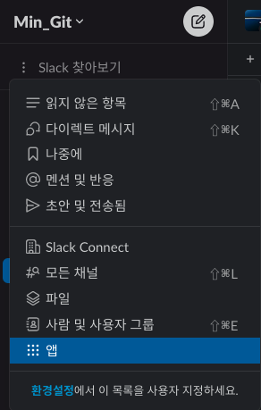
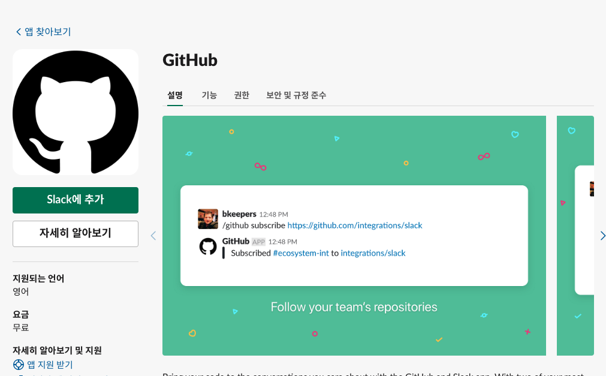
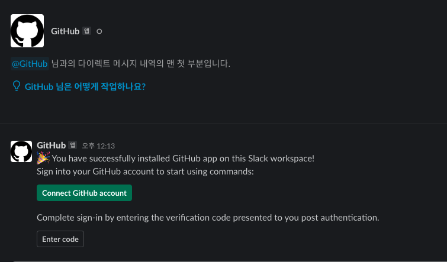
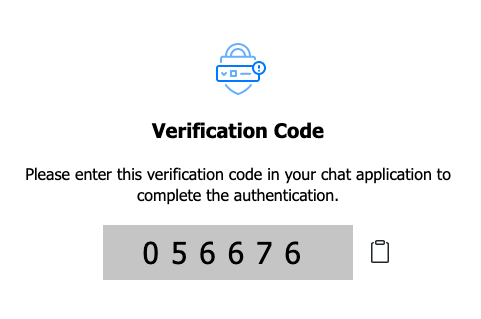
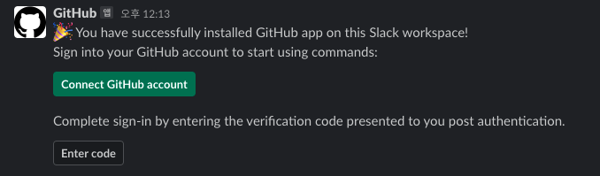
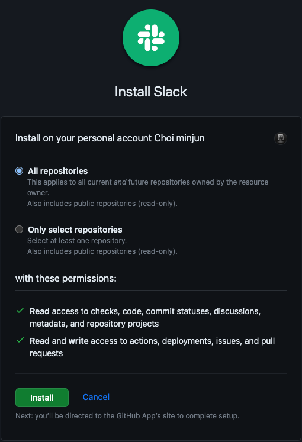
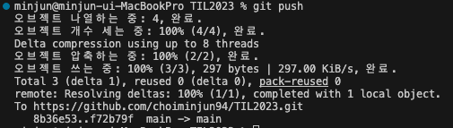

# 01)_GitHub Slack 연동

## 1. Slack에서 GitHub 설치

<br>

### Slack 찾아보기에서 앱 클릭

<br>

<br>

### GitHub 검색


<br>

### Slack에 추가 클릭



### 2. Slack과 GitHub 연동

<br>

### GitHub와 Slack 엑세스


<br>

<br>

### Connect GitHub account Click



<br>

<br>

<br>

### 코드 복사


<br>

### Enter Code 클릭 이후 코드 붙여 놓기

<br>

<br>

### 채널에서 아래의 코드 붙여 놓기 (레포지토리 여러개를 추가할 수 있다.)

```text

/github subscribe {owner}/{repository이름}

{}는 명령어 입력시에는 사용하지 않음
```

<br>

### install Slack Install


<br>

### Commit 한 내역 나오는지 확인



<br>
