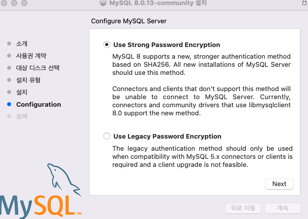

# Mysql 설치

## 1. Mysql Downloads

<br>
URL : https://dev.mysql.com/downloads/

```txt
1. MySQL Community Server 클릭

2. Select OS version : intel or 맥 실리콘인지 선택

3. Archives로 구형 버전 다운 가능

4. DMG Archive 파일 다운
```


<br>

<br>

## 2. MySQL 다운 파일 실행


<br>

<br>

## 3.MySQL 설치


<br>

<br>


```text
MAC PASSWORD 입력
```


<br>

<br>

```text

8자리 비밀번호를 만들면된다.

```


<br>

```text

MAC PASSWORD 입력

```


<br>


<br>

## 3. MySQL 실행

```cmd

1. cd /usr/local/mysql/bin
2. ./mysql -uroot -p
3. password 입력

```


