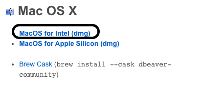
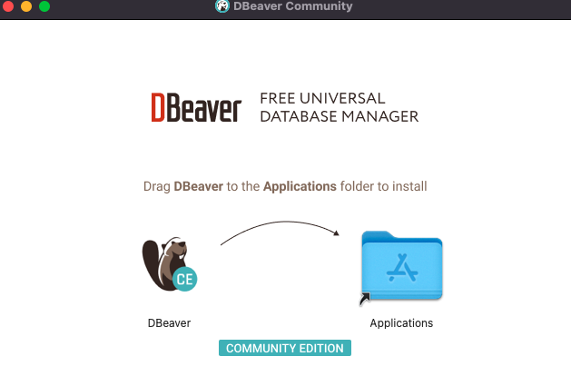
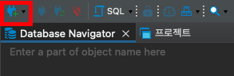
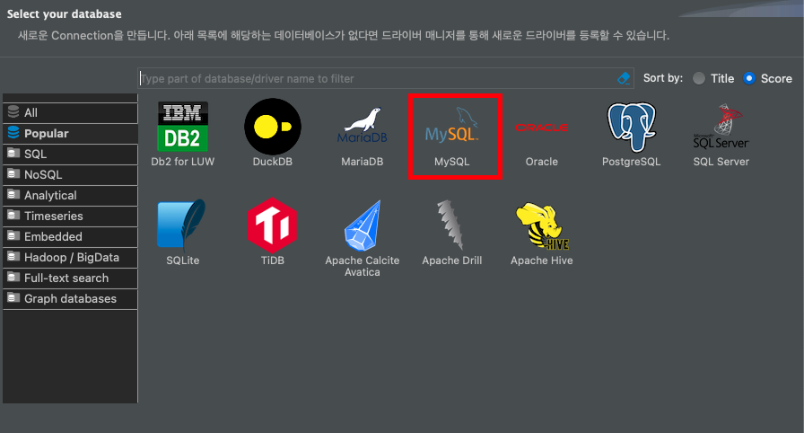
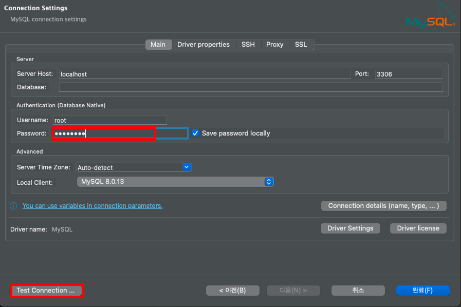
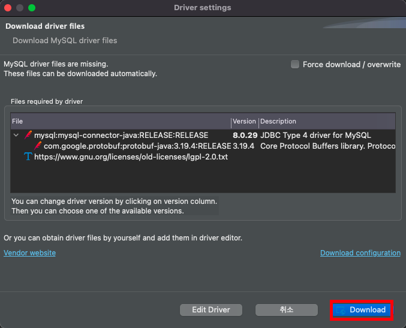
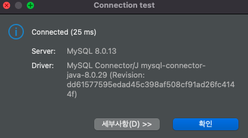
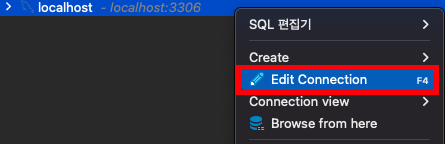
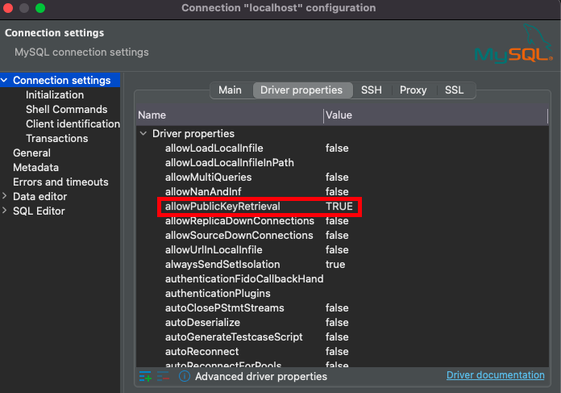

# DBeaver 설치

## 1. DBeaver Downloads

<br>
URL : https://dbeaver.io/download/



## 2. DBeaver 설치

```text

1. 다운로드 파일 실행
2. DBeaver icon Applications에 드래그
3. 런치패드 실행 후 DBeaver 실행

```


<br>

<br>

<br>
## 3. DBeaver 실행 및 Mysql 설치 (순서대로 진행)


<br>


> 패스워드 입력 후 Test Connection 진행 발생 가능성 있는 오류는 밑에 정리


<br>

<br>


## 4. 발생 가능성 있는 오류

### 1. public key retrieval is not allowed

```html
아래의 순서대로 진행
```
<br>

<br>


### 2. Access denied for user 'root'@'localhost' (using password: YES)

```html
단순 패스워드 오류이다.
```
